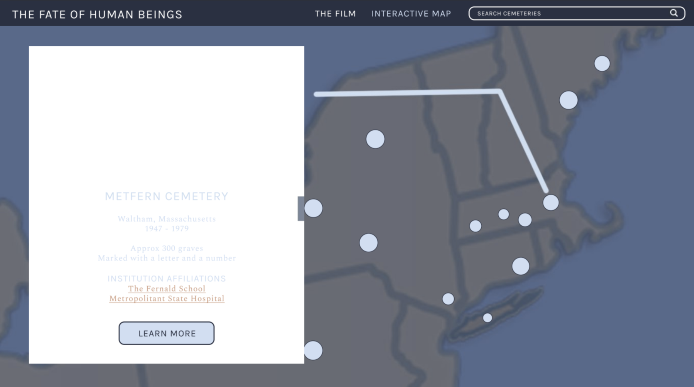
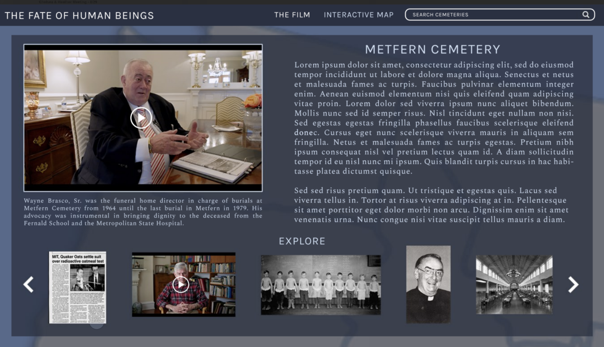

# Institution Cemetery Project

Welcome to Institution Cemeteries, an Interactive Web Map that plots unmarked graves of people with disabilities and mental illnesses in cemeteries in mental institutions. This project is a companion piece to _The Fate of Human Beings_ film

**This project needs to prioritize accessibility**

This project seeks to memorialize the people who were forgotten in these graves and to inspire research and cemetery rehab efforts

View the website here: (https://uconndxlab.github.io/institution-cemetery-project/)

## To Do ##
- [ ] Create Pop Up when each pinpoint is clicked that opens with a learn more button
- [ ] Once Learn More button is clicked it goes to a modal screen with all Information
- [ ] Create Alt tags for each image in the Pop Ups
- [ ] Input the rest of the information from the table into the spreadsheet
- [ ] Fix Napkin configuration

## Helpful Screenshots ##

This is how they would like the pop up to look like when you initially click on the pinpoint

This is how they would like the modal window to look after you click the Learn More button

## Communication in this Project ##
Most of the communication in this prjoect is done via Email with Heather and Chelsea, however, Basecamp contains some helpful documents such as the Google Sheet with all of the data as well as my project document

